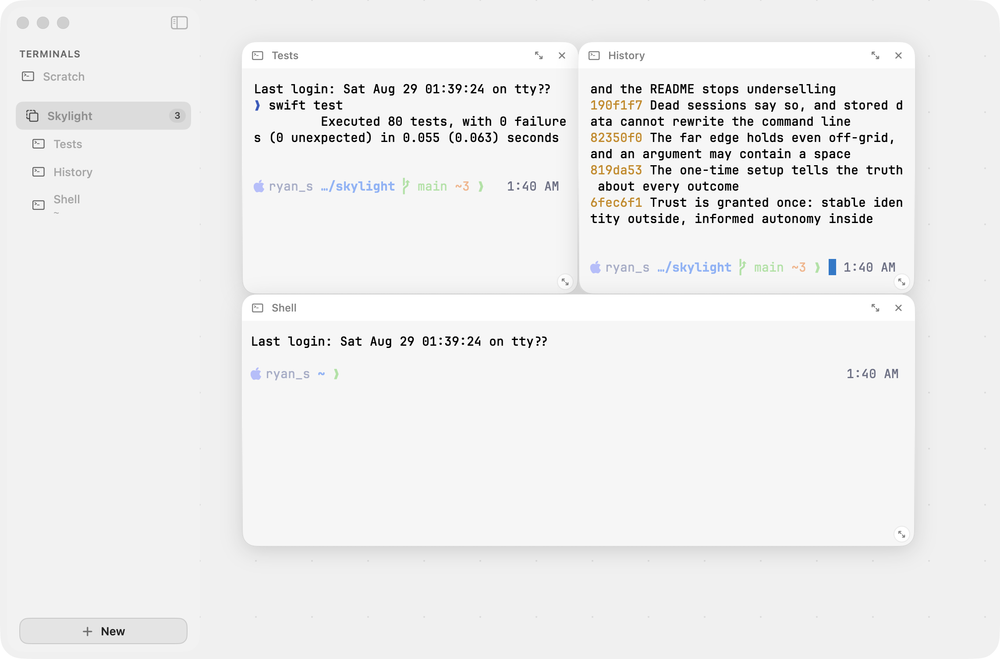

# Skylight

[](https://github.com/PrivateVictories-Main/skylight/actions/workflows/ci.yml)

A macOS-native terminal canvas. Terminal instances live in a left sidebar;
drag one and the window becomes an endless canvas where terminals are live,
draggable, resizable tiles. Swift + SwiftUI, with real Ghostty terminals.

<picture>
  <source media="(prefers-color-scheme: dark)" srcset="docs/media/hero-dark.png">
  
</picture>

*Real sessions, not mockups: the tiles above are live zsh surfaces — one ran
this repo's test suite, one its git log.*

## What it does

- **Real terminals** — GhosttyKit surfaces running your actual shell (zsh,
  bash, fish — whatever `/etc/shells` offers).
- **Sessions survive the app** — quit Skylight (or crash it) and relaunch:
  every terminal is still running, same processes, scrollback intact. A
  tiny bundled daemon (`skylightd`) owns the ptys over a user-only unix
  socket; the app is just a renderer that reattaches. Quitting doesn't even
  ask — there is nothing to lose anymore.
- **Endless canvases** — as many boards as you like; pan forever; every tile
  is a live session. Layout, pan, and zoom persist and restore instantly.
- **Drag-reveals-canvas** — start dragging a sidebar row and the canvas
  appears with a live ghost of where the tile will land. Drop it there; drag
  it back out and it's a full-window terminal again. A session survives every
  move.
- **Zoom with an honest contract** — at exactly 100% every tile is a real,
  typable terminal; at any other zoom the board is an overview, and clicking
  a tile flies back to it at 100%. Pinch, or ⌘+/−/0/1. (Scaling a live
  terminal can't be crisply interactive — so Skylight never pretends it is.)
- **Tiles that behave like windows** — drag by the header (or ⌘-drag
  anywhere), resize from any edge or corner, Rectangle-style magnet snapping
  against neighbors, 16pt grid otherwise. ⌘⇧A packs the whole board tidy.
  Shrink the window and the arrangement reflows to stay visible.
- **Focus mode** — expand any tile to the full window; ⌘. puts it back with
  the canvas exactly as it was. (Escape belongs to the terminal — vim and
  TUIs need it — so the exit is a real menu command.)
- **Agent terminals** — a terminal can launch an agent CLI (Claude Code,
  Codex, Gemini CLI, Copilot CLI, Cursor CLI, Qwen Code, Amp, OpenCode,
  Droid, Goose, Crush) on your existing subscription, each row wearing its
  vendor's own mark where one exists. Skylight detects what's installed and
  never fakes what isn't — and an agent terminal names itself after the
  first thing you ask it.
- **A New sheet that learns** — shell → mode → harness in one tiered sheet;
  your most-used combo becomes a one-click row; save any combo as a named
  preset for one-button launches. Double-click an empty canvas for an
  instant shell there; right-click to choose what runs.
- **Honest session state** — a background terminal that rings its bell gets
  a pulsing sidebar dot (and a Dock badge) until you look; a session whose
  process ended says "Session ended" instead of posing as live, with a
  one-click restart. Quitting with live sessions asks first.

## What it deliberately isn't

- No chat UI, no web views, no API keys, no network calls, no telemetry.
  The launch statistics behind recommendations are one local JSON file.
- No background cost worth naming — measured, not hoped: with live
  terminals on screen the app idles around 0.2% CPU; the session daemon
  holds steady at 0.0% CPU and ~5 MB. Hidden surfaces render nothing.
- One terminal engine: Ghostty, embedded via GhosttyKit. kitty and iTerm are
  apps, not libraries — Skylight won't pretend to embed them.
- No tabs. Sessions survive app relaunch, not reboot (launchd persistence
  is the next milestone).
- No interactive tiles at non-100% zoom: a scaled live terminal blurs glyphs
  and breaks hit-testing, so overview zoom is navigation, never a lie.

## Keyboard

- **⌘T** — New Terminal… (the tiered sheet)
- **⇧⌘T** — new shell terminal, launched instantly
- **⇧⌘N** — new canvas
- **⌘.** — back to canvas (leave focus mode)
- **⌘+ / ⌘− / ⌘0 / ⌘1** — zoom in / out / to fit / to 100% (⌘= works too)
- **⌘⇧A** — arrange the canvas

## Build & run

```
./scripts/make-app.sh && open build/Skylight.app
```

macOS 14+, Swift 6 toolchain. Debug appearance override:
`SKYLIGHT_APPEARANCE=dark ./build/Skylight.app/Contents/MacOS/Skylight`

## Grant access once

macOS ties permission grants to an app's code identity. An ad-hoc signature —
what a plain build produces — is a *new* identity every time, so every rebuild
looks like a brand-new app and every grant is forgotten. Two one-time steps fix
that for good:

```
./scripts/setup-signing.sh          # once, by hand — approve the one dialog
```

That creates a local "Skylight Dev" signing identity. `make-app.sh` detects it
automatically from then on (and tells you when it can't, so you are never
silently back to ad-hoc).

Then, once, grant Skylight **Full Disk Access** — the app's *Open Full Disk
Access Settings…* menu command opens the right pane. Every terminal and every
agent CLI running inside Skylight inherits that grant, and rebuilds keep it.

The grant follows the signing identity: anything signed with it, including a
tampered rebuild, inherits the access. That is the trade that makes grants
survive rebuilds; it is the same posture as any developer certificate.

Agent CLIs also ask for their own permission, separately from macOS. If you
want a given agent to stop asking, the New sheet's **Full autonomy** toggle
(shown for the agents that support it) names the exact flag it will launch
with. It is off until you turn it on, per agent.

## Architecture

Two targets, tests on the pure part:

- **SkylightCore** — models, layout math, shell/harness detection,
  recommendations, persistence + migration. No UI imports; unit-tested
  (`swift test`).
- **SkylightDaemonCore + skylightd** — the session keeper: framed wire
  protocol, per-session output ring, pty ownership (`posix_spawn` with a
  real controlling tty). The daemon exits when its last session ends;
  end-to-end tested against the real binary.
- **Skylight** — the SwiftUI app: `AppState` + `LiveSessionStore` (sessions
  outlive view churn), `DaemonClient` (sessions outlive the app), sidebar /
  canvas / sheet views.

The invariant everything obeys: **a running session survives every
transition** — full-window ↔ canvas ↔ other canvas ↔ focus.
`LiveSessionStore` owns each terminal NSView; SwiftUI only reparents it.

## Note for pre-carve users

Skylight once had an AI-chat layer. Its data is still on disk at
`~/Library/Application Support/Skylight/` (`chats/`, `webhistory/`) — the app
ignores it and will never delete it. Remove those folders manually if you
want the space back.

## License

[PolyForm Noncommercial 1.0.0](LICENSE.md) — free for any personal or
noncommercial use; commercial use requires a separate license from the author.
