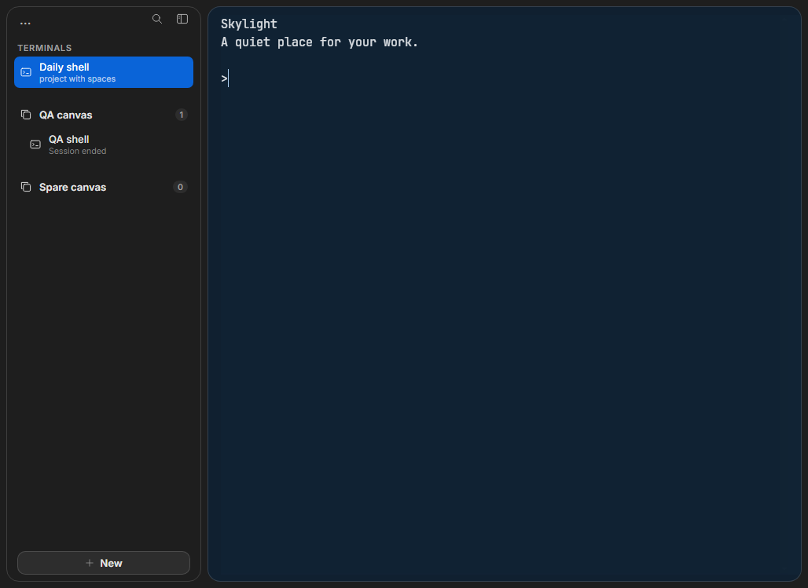
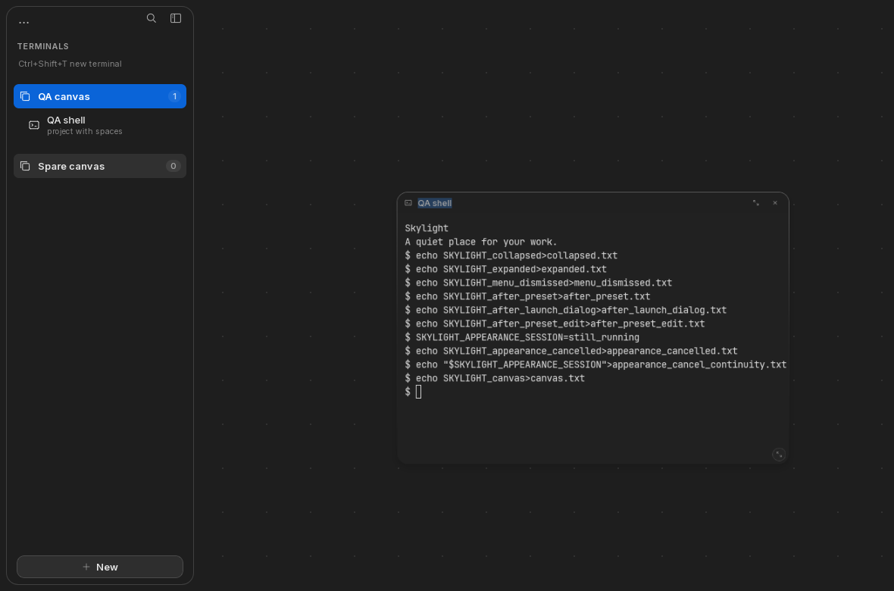
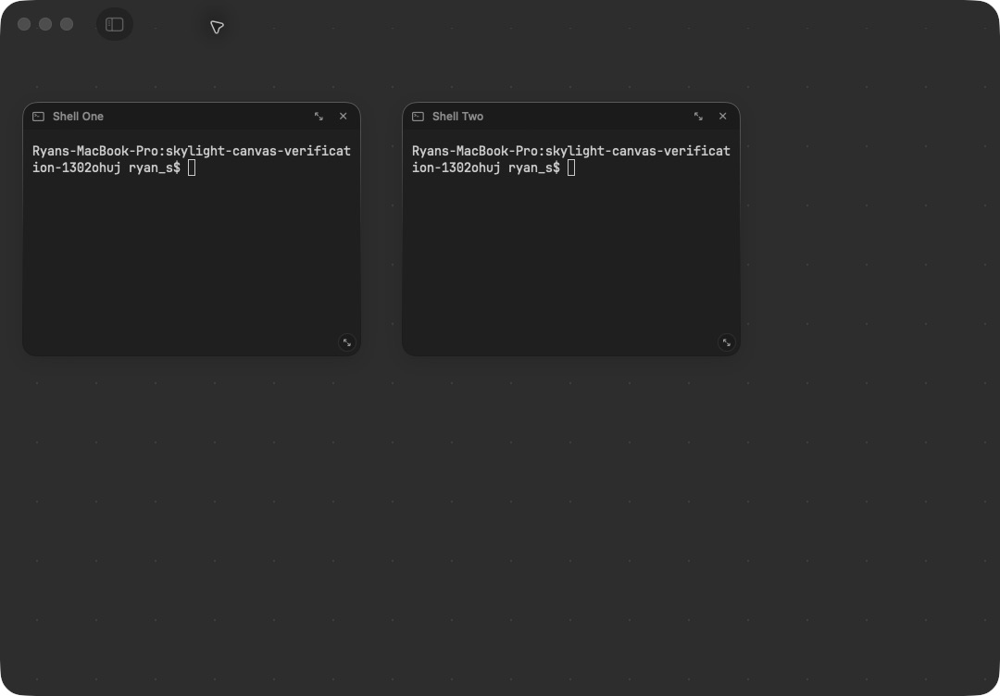

# Customization and canvas reliability — September 5, 2026

The audit found functional gaps behind the similar-looking interfaces. This pass
adds portable appearance controls and repairs specific native and portable canvas,
theme, and sign-in paths. It does not establish complete one-to-one feature parity.

## Changes you can use

**Windows/Linux:** open the workspace menu → **Appearance**. Theme browsing,
import, fonts, opacity, colors, cursor, padding, ANSI colors, and background images
stay in this on-demand panel. **Browse themes** searches the same 485 definitions
bundled with native macOS; it renders at most ten matches at a time. A detected
Ghostty, Windows Terminal, or VS Code config has a one-click import action. Files
can also be selected through the native picker. Ghostty named catalog themes and
explicit overrides resolve together; unsupported settings are listed.

Edits preview in existing terminals. **Cancel** restores the saved appearance;
**Save appearance** atomically stores the new settings and prior snapshot.
**Revert appearance** in the workspace menu restores that prior state, including
after restarting. Existing shell processes and scrollback are retained while
changing appearance. The Appearance panel loads on demand.

PNG/JPEG images are copied into managed appearance storage; no manual file copying
is required. Opacity reveals an image or Skylight's backing surface within the
application. This is not desktop/window glass. Inputs are bounded to 8 MiB and
reasonable pixel dimensions. Arbitrary theme behavior, commands, includes, scripts,
and external image references are not executed or followed.

**Native macOS:** standalone Windows Terminal scheme files now import correctly.
Modern percentage opacity and legacy acrylicOpacity have distinct meanings.
Ghostty discovery recognizes current config.ghostty locations and performs automatic
discovery off the UI thread. Imported themes now use one atomic library with exact
names and durable undo: same-name reimports and punctuation-name collisions no
longer destroy the prior palette. Failed saves do not publish a successful-looking
selection. Older sidecar files remain readable; old app builds cannot read newly
created library imports.

**Canvas navigation:**

- Native canvas zoom shortcuts now reach the canvas even when a terminal has focus.
  Full-window terminals retain their own font shortcuts.
- Native overview tiles accept panning; ordinary terminal scrolling at 100% remains
  terminal scrolling. Pinch settling preserves its anchor, and magnet distances
  are measured consistently across zoom levels.
- The painted native collapsed-sidebar toolbar band and hairline were removed;
  clearance for system window controls remains.
- Windows/Linux keep live terminal surfaces during overview zoom, with a click-to-
  100% overlay. Pure zoom does not recreate the renderer or resize the PTY grid.
- Portable wheel/pinch navigation preserves the pointer anchor; small pinch deltas
  accumulate. Claimed canvas shortcuts and pinch events are handled before xterm.
- Portable grid/neighbor snapping, **Fit canvas**, and **Arrange terminals** are
  available in contextual/workspace menus. Ctrl+Shift+plus/minus zoom,
  Ctrl+Shift+0 returns to actual size, Ctrl+Shift+9 fits, and Ctrl+Shift+A arranges.
- Returning to 100% restores terminal keyboard focus. Presets launched from a
  canvas now retain that destination.

**Sign-in status:** Claude and Codex's documented signed-out exit status now reaches
native Skylight's sign-in UI. Only declared negative replies on the expected exit
code are accepted; unexpected failures remain unknown. Authentication continues
inside the official CLIs. Sign-in is not proof of subscription entitlement or
remaining allowance.

## Verification

Application source: [be8c598](https://github.com/PrivateVictories-Main/skylight/commit/be8c59897d98a54db061da7935252215a4452cd0),
with portable input/focus follow-up [c4373b5](https://github.com/PrivateVictories-Main/skylight/commit/c4373b5560477650b428b69d413084ada509c55f).

- **448 native tests**, plus native packaged-release/resource verification.
- **27 frontend tests** and **32 Rust/PTY tests**, plus type/build/format/Clippy checks.
- **15 real-app workflows on each of Windows Server 2022 x64 and Ubuntu 24.04 x64**.
  These drive built release apps through native WebDriver and prove actual shell
  execution, including a shell variable surviving theme preview/save/revert.
- Native isolated UI checks: collapse, keyboard zoom, overview pan, live-terminal
  scroll, resize, magnet, and shell input; standalone Windows theme imports,
  same-name replacement, restart, and exact palette revert.
- A local portable Mac development build also verified live import, Cancel, Save,
  keyboard catalog search, and undo. Its background picker opened, but automated
  completion of image selection was not verified.

[Windows/Linux run and packages](https://github.com/PrivateVictories-Main/skylight/actions/runs/33945964647) ·
[Native macOS run](https://github.com/PrivateVictories-Main/skylight/actions/runs/33945964672)

No provider login, paid API call, or credential transfer was performed. Native
checks used isolated bundles/workspaces; the user's open app was preserved.

## Remaining gaps

Right/top/bottom navigation placement is not implemented. Native automatic canvas
reflow still resizes tiles when the viewport shrinks; this needs an explicit layout
policy and stable-host tests. Portable docking remains behind native macOS.

Native background-image customization and portable iTerm2/Warp/kitty/Alacritty/
WezTerm imports still need work. Portable import currently maps the first sixteen
ANSI colors and supported cursor/selection fields; it does not reproduce every
setting in an arbitrary terminal config. File-picker completion on Windows/Linux,
image-picker completion, full light-mode accessibility, and installer/upgrade flows
need their own checks.

Provider onboarding and verified brand assets remain incomplete in portable UI.
The native brand paths need a pinned provenance record before claiming current
logos. Portable sessions still end when the app exits. Physical trackpad feel,
GPU/input latency, IME, WSL/PowerShell breadth, and real-device performance budgets
are not established by VM workflow checks.

## Official contracts consulted

- [Ghostty configuration](https://ghostty.org/docs/config): config locations and composition.
- [Windows Terminal schemes](https://learn.microsoft.com/en-us/windows/terminal/customize-settings/color-schemes)
  and [profile opacity](https://learn.microsoft.com/en-us/windows/terminal/customize-settings/profile-appearance#opacity).
- [Claude CLI reference](https://code.claude.com/docs/en/cli-reference): signed-out auth status exit1.
- [Pinned Codex login implementation](https://github.com/openai/codex/blob/459a79eb85400af759e9220c7bafb4429ae07516/codex-rs/cli/src/login.rs#L499-L501): negative reply and exit1.

The shared theme catalog has a [deterministic generation and license record](../shared/terminal-themes.md).

## Saved evidence

[Windows workflows](verification/customization-navigation/windows.json) ·
[Linux workflows](verification/customization-navigation/linux.json) ·
[Native canvas checks](verification/customization-navigation/Skylight-native-canvas-verification.json) ·
[Native theme import/restart/undo](verification/customization-navigation/Skylight-native-theme-verification.json) ·
[Portable local appearance checks](verification/customization-navigation/Skylight-appearance-local-verification.json)

