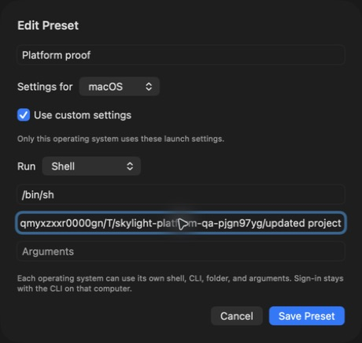
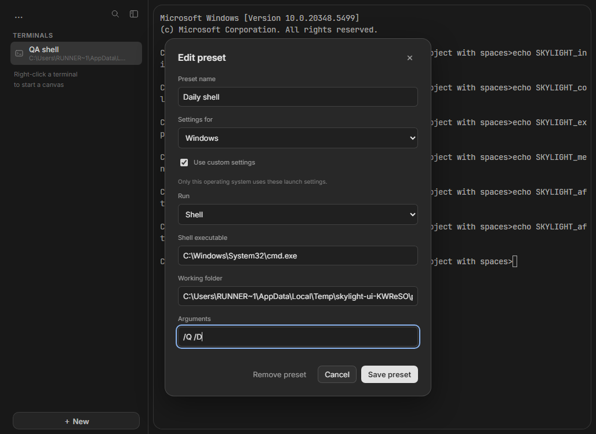
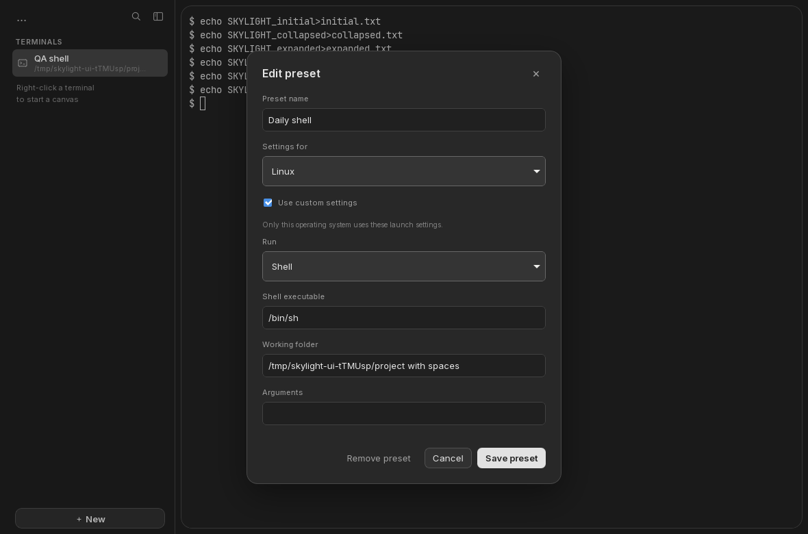

# Platform preset verification — September 4, 2026

A saved preset now supports complete launch settings for each operating system.
One launch button resolves the local shell or AI CLI, folder, and arguments.
The advanced editor stays inside New; the workspace keeps its existing minimal
layout. Native preset imports preserve other-platform settings, and native saves
publish changes only after the atomic disk write succeeds.

Feature source: [adb9f4d](https://github.com/PrivateVictories-Main/skylight/commit/adb9f4de8aad8be3c7a56f5e8728ca75d087d1b8).
Native launch-focus follow-up: [8e2ce49](https://github.com/PrivateVictories-Main/skylight/commit/8e2ce490b30bea3c3f5115f9130d4ed1f035d379).
[User guide and file contract](platform-presets.md).

## Verified behavior

Windows Server 2022 x64 and Ubuntu 24.04 x64 each passed **12 real-application
workflows**, **9 frontend tests**, and **15 Rust tests**, including actual ConPTY
or Unix PTY processes. Formatting, Clippy, frontend builds, NSIS packaging, and
Debian packaging passed. The native WebDriver checks exercise the release app
without mocked runtime calls.

The new workflow deliberately makes shared defaults and a foreign OS configuration
unsuitable for launching. It edits valid settings for the current OS, saves them,
checks the stored file, cancels another edit, launches through keyboard search,
and launches again after workspace restoration. Shell-created files prove the
correct folder and process actually ran. Other OS settings and shared defaults
remain intact. Existing canvas, process lifecycle, input, measured layout, and
bundled-font checks also passed.

[Windows/Linux results, screenshots, and installers](https://github.com/PrivateVictories-Main/skylight/actions/runs/33929136283).
The native-only focus follow-up does not change portable source or packages.

The native macOS release app was separately driven through its actual UI with an
isolated workspace. Its preset's default configuration specified Codex and an
unsuitable folder; the macOS entry selected `/bin/sh` and a valid folder with spaces.
The checks established:

- Editing the macOS folder persisted it and preserved shared, Windows, and Linux settings.
- Cancelling an edit left the stored preset file byte-for-byte unchanged.
- New, workspace search, and the canvas context menu launched the resolved shell
  in the edited folder, proven by shell-created files.
- New and canvas launches accept keyboard input without clicking the terminal.
  This check found and fixed a missing focus request; the existing sheet-lifecycle
  handler delivers focus after the native sheet closes.

The native suite passed **422 tests** and release bundle/resource verification.
[Feature macOS run](https://github.com/PrivateVictories-Main/skylight/actions/runs/33929136255).
[Focus follow-up macOS run](https://github.com/PrivateVictories-Main/skylight/actions/runs/33929704635).

Durable check records: [Windows](verification/platform-presets/windows.json),
[Linux](verification/platform-presets/linux.json), and
[native macOS](verification/platform-presets/macos.json).

## Actual editor captures

Native macOS:

Windows:

Linux:

These are real app captures, not mockups. Native controls, window dimensions, and
OS rasterization differ. The Windows/Linux captures exclude host window decorations.

## Remaining scope

Presets transfer configuration through explicit files. They do not sync credentials,
subscriptions, running processes, or folders between computers. Installed CLIs own
their authentication. Provider login and paid API calls were not exercised here.
Older Skylight builds can discard the optional platform map when re-exporting.

VM workflow checks do not certify physical input latency, GPU performance, IME,
all shells or Linux distributions, or installer-wizard behavior. Portable sessions
still end when the app exits; the next backend priority is a reconnectable keeper
with process-identity and crash/restart evidence. See the
[development direction and acceptance gates](development-roadmap.md) for the full
remaining scope, and [visual verification](quality-verification.md) for the design
contract retained by this pass.
