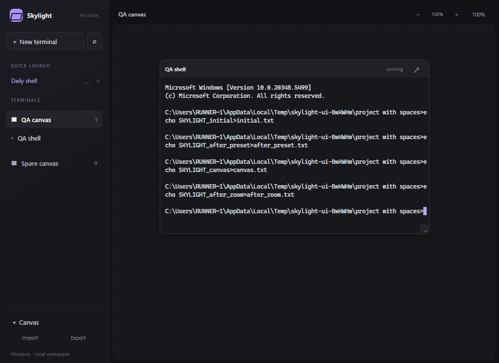
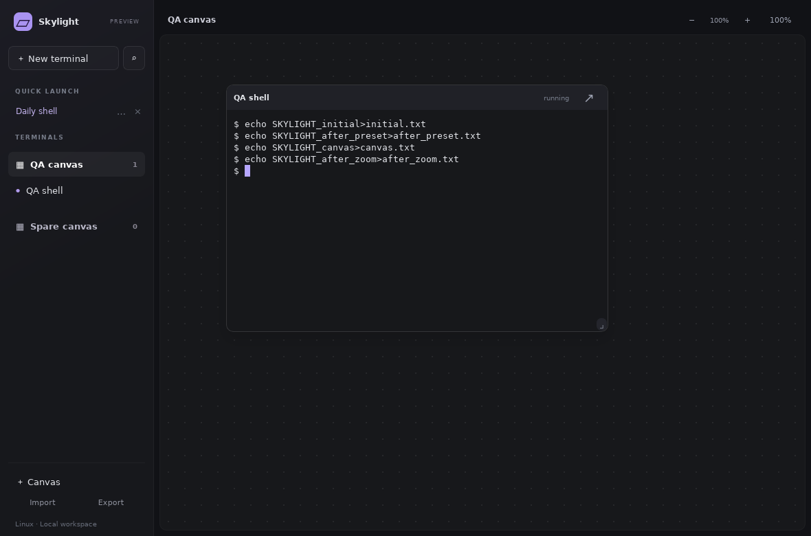

# Desktop verification — September 4, 2026

The Windows and Linux preview passed the same nine native app interaction checks
on public GitHub-hosted virtual machines. The tests drive the built release app
through native WebDriver and require actual shell commands to create files in a
working folder containing spaces. They do not mock terminal execution or Tauri IPC.

Verified application source: [`92771bb`](https://github.com/PrivateVictories-Main/skylight/commit/92771bbf519f17964c702b9bffe665afd9c36092).

| Check | Windows Server 2022, x64 | Ubuntu 24.04, x64 |
| --- | --- | --- |
| Native app startup | Passed | Passed |
| Shell launch with explicit working folder | Passed | Passed |
| Save a reusable launch preset | Passed | Passed |
| Create a canvas and move a live terminal | Passed | Passed |
| Resize, move, zoom, and observe process exit in a canvas | Passed | Passed |
| Cancel close and continue typing | Passed | Passed |
| Exit and restart a terminal | Passed | Passed |
| Ctrl+Shift+P search and preset launch | Passed | Passed |
| Reopen saved workspace, keep restored sessions stopped, then launch explicitly | Passed | Passed |

[Windows/Linux run and artifacts](https://github.com/PrivateVictories-Main/skylight/actions/runs/33925062274).
Both platforms also passed seven frontend tests, thirteen Rust runtime tests,
type checking, formatting, and Clippy. The workflow built an NSIS installer and
a Debian package. The UI suite used `cmd.exe` on Windows and `/bin/sh` on Linux.

The native SwiftUI/Ghostty macOS app separately passed **419 tests** and its
packaged-release verification. [macOS run](https://github.com/PrivateVictories-Main/skylight/actions/runs/33925062232).
A local Mac development build of the portable app also completed a live first-canvas
move, shell command, exit-status update, saved-layout check, and normal quit.

## Improvements covered by this pass

- Launch settings open immediately while CLI discovery refreshes in the background.
- Visible terminal renderers survive routine redraws and moves. Hidden terminals
  still release their GPU resources.
- Moving to the first canvas creates it and places the terminal in one flow.
- Canvas tiles update process status while preserving typing focus.
- Terminal overlay layers stay below canvas resize controls.
- The output-backpressure regression waits for real saturation, including delayed
  startup, before proving another terminal can continue independently.

## Actual preview screenshots

Windows:

Linux:

## Test environment and limits

Standard public GitHub-hosted runners are
[free for public repositories](https://docs.github.com/en/actions/reference/runners/github-hosted-runners).
These workflows skip private repositories. Linux uses Xvfb, Openbox, and an isolated
session bus; there is no graphics override in the app or final CI configuration.
The harness waits for terminal layout before pointer actions and cleans up its
own native driver and application processes.

These results establish tested preview workflows, not feature parity or device
certification. The installer wizards, provider sign-ins, paid API requests,
PowerShell interaction, native import/export dialogs, clipboard, IME, accessibility,
Windows 11 client hardware, and physical GPU/input latency were not exercised by
this suite. Reported elapsed times include automation overhead and are not product
performance benchmarks. Portable session survival after app exit, full native
canvas parity, and per-platform preset overrides remain separate work.

UI artifacts are retained for seven days and installer artifacts for fourteen days.
The screenshots and verification record above are preserved in Git history.
