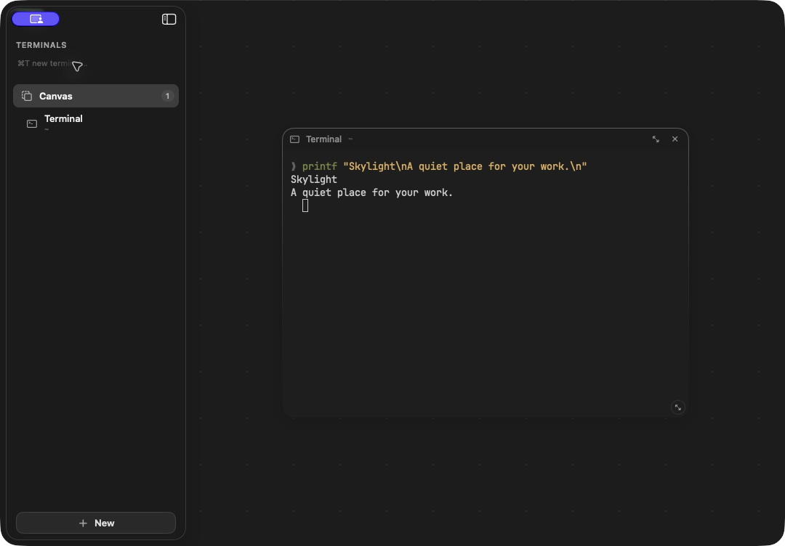

# Desktop visual alignment and verification — September 4, 2026

For the subsequent platform-preset pass, including 12 target-OS workflows and
422 native tests, see [platform preset verification](platform-preset-verification.md).
This page preserves the earlier visual-alignment baseline.

Windows and Linux now follow the native macOS workspace structure: a quiet sidebar,
a bare terminal panel, and a sparse canvas. The previous preview's prominent logo,
Quick Launch sidebar section, and permanent terminal-action toolbar were removed.
Presets live in **New** and search; advanced commands live in contextual menus.

Verified application source: [`3d1fa24`](https://github.com/PrivateVictories-Main/skylight/commit/3d1fa24f8826dab4b4e37b748e688a418db63b9d).

## Design reference and enforced geometry

The actual SwiftUI/Ghostty macOS app was opened with an isolated workspace in dark,
solid appearance. Its terminal and canvas were inspected directly. The portable
Mac development app was then compared against it; it was not used as the native
reference. See [the design contract](visual-design.md) for the source components.

Both target operating systems passed measured checks for a **256-pixel sidebar**,
**8-pixel terminal inset**, **16-pixel panel corners**, **no persistent terminal
toolbar**, **30-pixel tile headers**, and **64-pixel canvas grid** at 100%. Presets
are absent from the sidebar. New tiles start at 560 × 400 and are brought into view.

Inter UI and JetBrains Mono are bundled locally, with upstream licenses and pinned
source hashes in [the font record](../desktop/public/fonts/README.md). The UI suite
verifies both faces loaded. No font installation or runtime download is required.

## Actual app interaction checks

The same eleven checks passed on Windows Server 2022 x64 and Ubuntu 24.04 x64.
Native WebDriver drives the built release application, and actual shell commands
must create files inside a working folder containing spaces. Tauri calls and PTY
execution are not mocked.

| Check | Windows | Linux |
| --- | --- | --- |
| Native app startup | Passed | Passed |
| Shell launch, working folder, measured visual layout, bundled fonts | Passed | Passed |
| Sidebar collapse/expand and menu keyboard dismissal, then shell input | Passed | Passed |
| Save preset, find it in New, dismiss dialog, continue typing | Passed | Passed |
| Create canvas and move a live terminal | Passed | Passed |
| Resize, move, zoom, and observe process exit on a canvas | Passed | Passed |
| Cancel close and continue typing | Passed | Passed |
| Exit and restart a terminal | Passed | Passed |
| Ctrl+Shift+P search and preset launch | Passed | Passed |
| Restore saved workspace without automatically executing sessions | Passed | Passed |
| Double-click canvas to launch, detach tile, keep shell running | Passed | Passed |

[Windows/Linux run and downloadable artifacts](https://github.com/PrivateVictories-Main/skylight/actions/runs/33927556953).
Both platforms also passed seven frontend tests, thirteen Rust runtime tests,
type checking, formatting, and Clippy. NSIS and Debian packages were built. The UI
suite exercised `cmd.exe` on Windows and `/bin/sh` on Linux.

The native macOS app separately passed **419 tests** and packaged-release verification.
[macOS run](https://github.com/PrivateVictories-Main/skylight/actions/runs/33927556980).
A local Mac development build of the portable application was also checked with a
live shell, the simplified launch dialog, contextual actions, canvas creation,
and removing a tile without ending its process.

## Captured previews

Native macOS reference (dark, solid appearance; the system capture indicator covers
the window controls):

Windows release application:

Linux release application:

The target-OS screenshots capture app content through native WebDriver, excluding
the host window decorations. Test window dimensions and shell prompts differ.
They are real running applications, not design mockups. Terminal and New-dialog
screenshots are also [preserved in Git](images/):
[Windows terminal](images/verified-windows-terminal.png),
[Linux terminal](images/verified-linux-terminal.png),
[Windows New dialog](images/verified-windows-new-terminal.png), and
[Linux New dialog](images/verified-linux-new-terminal.png).

## Environment and limits

Standard public GitHub-hosted runners are
[free for public repositories](https://docs.github.com/en/actions/reference/runners/github-hosted-runners).
The workflows skip private repositories. Linux runs with Xvfb, Openbox, and an
isolated session bus; no application graphics override is used.

The default portable appearance is opaque dark; native Mac glass, theme controls,
OS window decorations, and rasterization are not pixel-identical. These results
establish the measured design and tested interactions. They do not establish full
feature parity, physical input latency, GPU performance, complete accessibility,
IME, clipboard, installer-wizard, provider sign-in, paid API, or native file-dialog
validation. Portable session survival after app exit remains separate work.

UI artifacts are retained for seven days and installers for fourteen days.
The screenshots and this record are preserved in Git history.
