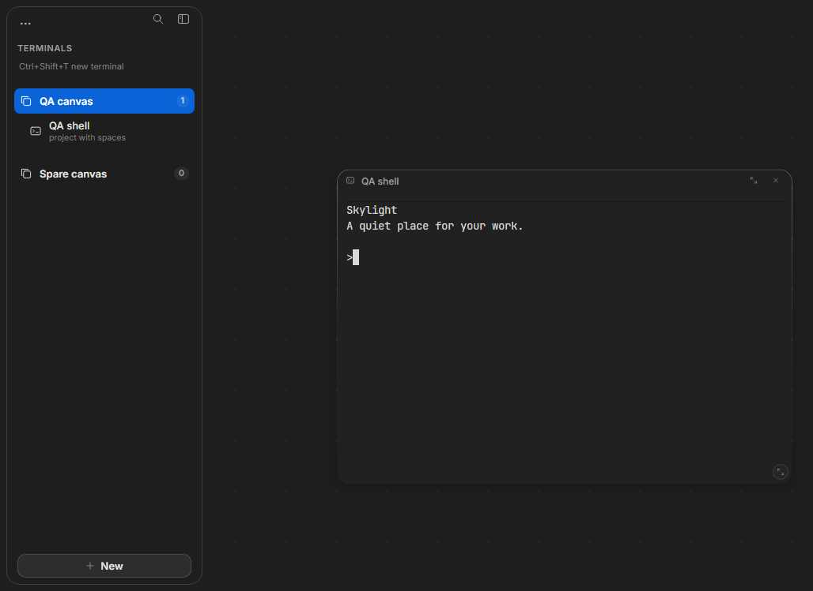
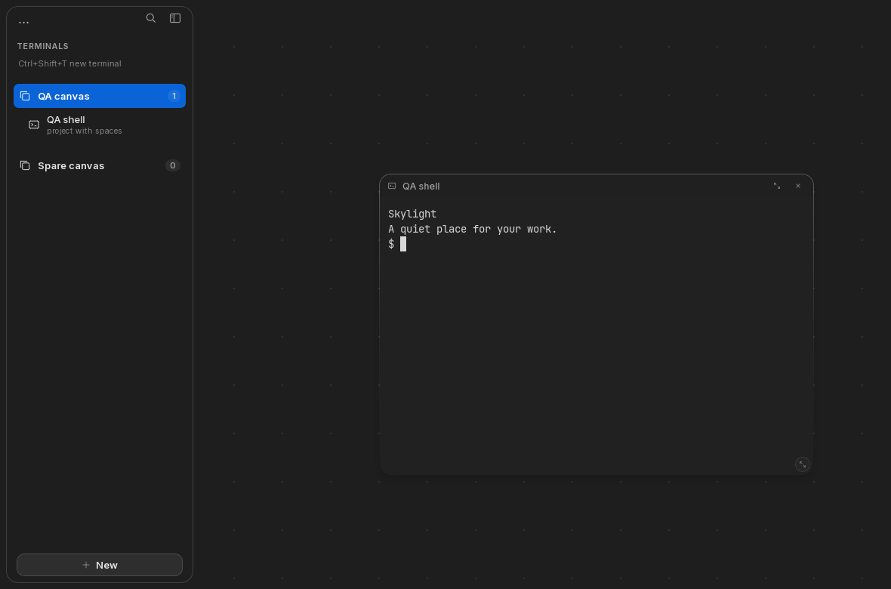

# Closer to the native macOS interface — September 4, 2026

This pass refines Windows and Linux against the actual native macOS dark, solid
reference preserved in [the visual baseline](quality-verification.md). It retains
the terminal-first layout, shared sidebar width, sparse canvas, and on-demand
advanced settings.

Application source: [7bd809e](https://github.com/PrivateVictories-Main/skylight/commit/7bd809e0cf7ca27c9a68e69a0cc45a9925f560c6).
Scrollbar refinement: [f4a36f9](https://github.com/PrivateVictories-Main/skylight/commit/f4a36f9).

## Changes

- The sidebar is now an inset surface with 16-pixel corners, replacing its straight
  full-height divider. Its New button sits 17 pixels above the window bottom, as
  in the native reference.
- Canvas tiles use the native-style fading border highlight and restrained shadow.
  Headers keep their 30-pixel height, with smaller, consistent SVG controls for
  focus, removal, and resizing.
- Terminal scroll thumbs are inset and rounded while keeping xterm's full drag
  target. This fixes a wide square thumb observed in the actual Windows capture.
- Blue primary buttons and active selections follow the default macOS accent.
  An inactive window uses a neutral selection.
- Folder captions show the directory name; hover retains the full launch path.
  Stored paths and search behavior are unchanged.
- Select controls share their rounded outline and chevron across browser engines.
  They retain native keyboard and accessibility semantics. Forced-color mode
  restores system select appearance and visible surface outlines; reduced-motion
  preferences remain respected.

The Windows/Linux test suite now checks the sidebar's rounded frame and inset,
bottom button spacing, compact folder caption, select geometry, and SVG controls,
alongside the existing process, keyboard, canvas, and preset checks. Clean previews
are created by commands executed inside the actual QA shell. They are screenshots
of the running release application, not injected terminal text or visual mockups.

## Verified results and previews

Both Windows Server 2022 x64 and Ubuntu 24.04 x64 passed all **12 real-app
workflows**, **9 frontend tests**, **15 Rust tests**, frontend builds, formatting,
and Clippy. Windows NSIS and Linux Debian packages were produced. The native
macOS app passed **422 tests** and packaged-release verification. A local portable
Mac development build also verified shell output, dialog dismissal, and focus
controls; the design reference remains the native SwiftUI app.

[Final Windows/Linux run](https://github.com/PrivateVictories-Main/skylight/actions/runs/33935033312) ·
[macOS run](https://github.com/PrivateVictories-Main/skylight/actions/runs/33935033235) ·
[Windows check record](verification/rounded-interface/windows.json) ·
[Linux check record](verification/rounded-interface/linux.json)

Windows release application:

Linux release application:

Full terminal views: [Windows](images/rounded-windows-terminal.png) and
[Linux](images/rounded-linux-terminal.png). Launch dialogs:
[Windows](images/rounded-windows-new-terminal.png) and
[Linux](images/rounded-linux-new-terminal.png).

The screenshots exclude host window decorations; test window dimensions, shell
prompts, and user-adjustable canvas positions differ. Packages were built, but
installer-wizard, upgrade, and uninstall behavior were not exercised in this pass.

## Scope

This is closer visual alignment, not a claim of pixel identity across every OS.
Native macOS materials, configurable themes, system title bars, font rasterization,
and some launch-dialog structure still differ. The portable default is dark and
opaque. Target-OS VM checks do not certify physical latency, every display scale,
all desktop environments, full accessibility, or complete feature parity.
